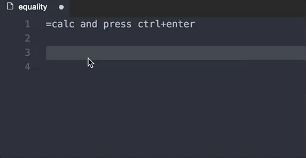
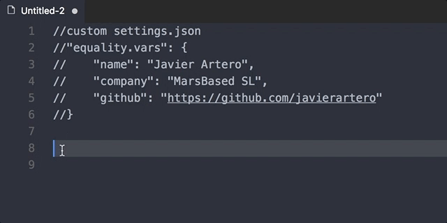
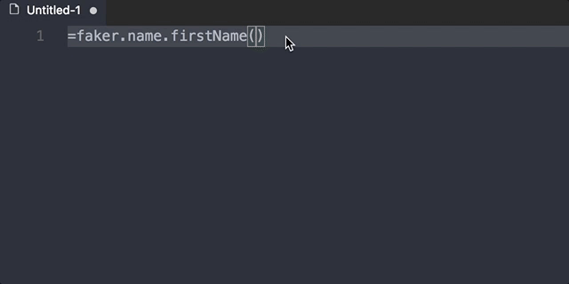

# equality README
This plugin use eval() and external libraries to evaluate and replace javascript content

## You can calculate
```
=2+2 //Press Ctrl + Enter
```


## You can create personal vars
Add equality.vars in your users settings
```
"equality.vars": {
    "name": "Javier Artero",
    "company": "MarsBased SL",
    "github": "https://github.com/javierartero"
}
```
Reload the plugin with reload window

When you call a ```=e``` you will be calling equality.vars
```
=e.name_var //Press Ctrol + Enter
```


* [faker.js gitHub](https://github.com/marak/Faker.js/)
* [JSDoc API Browser](http://marak.github.io/faker.js/)
## You can use the "faker.js"
faker.js is an external library generate massive amounts of fake
```
=faker.name.findName() //Press Ctrol + Enter
```


* [faker.js gitHub](https://github.com/marak/Faker.js/)
* [JSDoc API Browser](http://marak.github.io/faker.js/)

## Put an equality in your life...