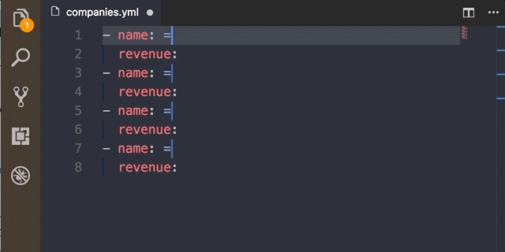
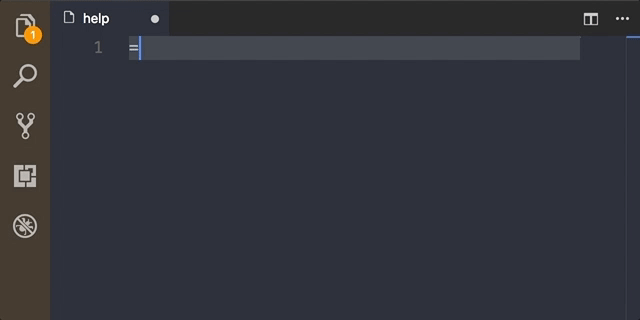
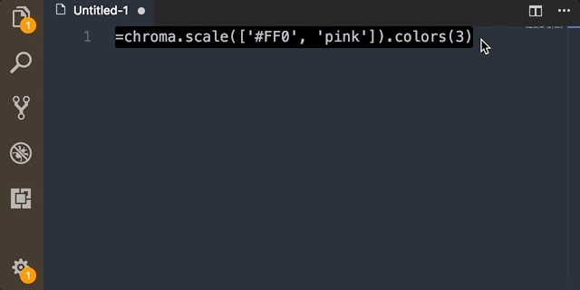

# equality README
This plugin use eval(), custom functions, methods and external libraries to evaluate and replace javascript content

## You can use multiples cursors <a id="multiple-cursor"></a>



## You can calculate <a id="calculate"></a>
```
=2+2 //Press Ctrl + Enter
```


## You can create personal vars <a id="custom-vars"></a>
Add equality.vars in your users settings
```
"equality.vars": {
    "name": "Javier Artero",
    "company": "MarsBased SL",
    "github": "https://github.com/javierartero"
}
```
Reload window

When you call a `=e` you will be calling equality.vars
```
=e.plugin //Press Ctrol + Enter
```


## Help

Now the plugin has a help system that will appear when it is not able to evaluate the content

You can open all the help elements from the method
```
=help
```



## You can use the "faker.js"
faker.js is an external library generate massive amounts of fake
```
=faker.name.findName() //Press Ctrol + Enter
```


* [faker.js gitHub](https://github.com/marak/Faker.js/)
* [JSDoc API Browser](http://marak.github.io/faker.js/)

## Custom functions and methods

### rand(min:number = 0, max:number = 100) <a id="rand"></a>


Default arguments
min:number = 0, max:number = 100

```
=rand(-100,100)
```

## You can use the [chroma.js](http://gka.github.io/chroma.js/)

*chroma.js* is a tiny JavaScript library (14kB) for dealing with colors!

* read colors from a wide range of formats
* analyze and manipulate colors
* convert colors into wide range of formats
* linear and bezier interpolation in different color spaces




### rgb(r:number, g:number, b:number)


### hex(hex:string) <a id="hex"></a>

This method allows the use of shorthand '# ff0'


## Put an equality in your life...