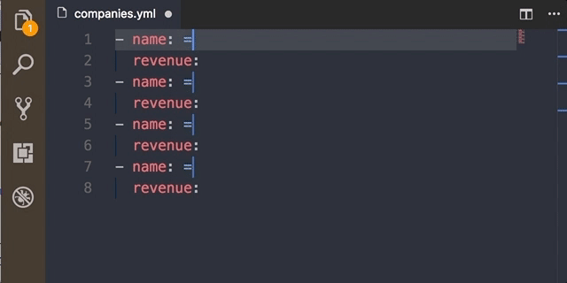
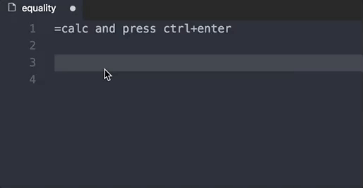
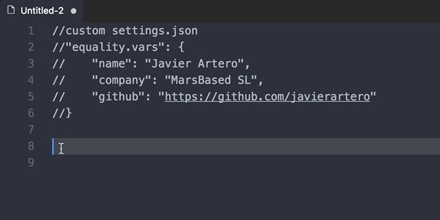
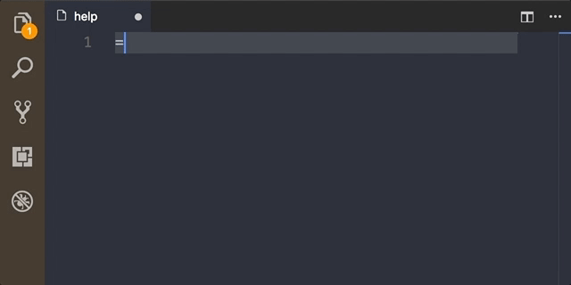
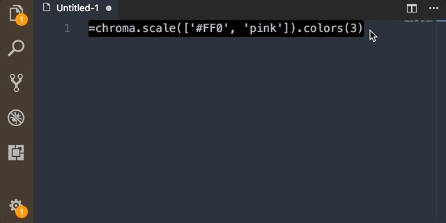
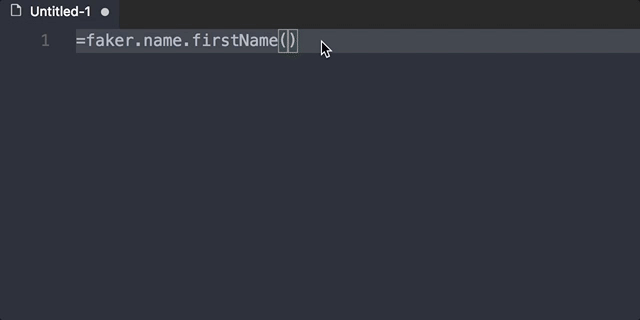
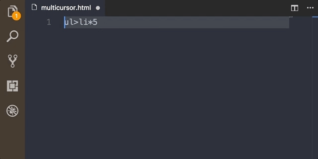

# Equality

Equality evaluates JavaScript expressions inline inside the active editor and replaces them with the result.

## Multi-cursor support

Each cursor evaluates the expression that starts at the last configured symbol on its current line.



## Calculate expressions

Write an expression starting with the configured equality symbol and place the cursor at the end of the expression.

```text
=2 + 2
```

Run `Equality: Evaluate expression` with `Ctrl+Enter` on Windows/Linux or `Cmd+Enter` on macOS.



## Custom variables

Add variables in your VS Code settings through `equality.vars`. They are exposed inside expressions as `e.<name>`.

```json
"equality.vars": {
  "name": "Javier Artero",
  "company": "MarsBased",
  "github": "https://github.com/javierartero"
}
```

Example:

```text
=e.name
```



## Help

Use `=help` to open the documentation picker. When an evaluation fails, Equality shows relevant documentation links for the current expression.

```text
=help
```



## Bundled libraries

### `chroma-js`

Equality exposes `chroma` and the alias `c`.

```text
=chroma.scale(['#FFF', 'blue']).colors(5)
=c('white').hex()
```



### `lodash`

Equality exposes lodash through `_`.

```text
=_.camelCase('change of format case')
=_.repeat('I will not copy in class \n', 5)
```


### `faker`

Equality exposes `faker` and the alias `f`. The locale is controlled through `faker.locale`.

```text
=faker.name.findName()
```



## Built-in helpers

### `rand(min = 0, max = 100)`

```text
=rand(-100, 100)
```



### `rgb('#ff00aa')`

Converts a hexadecimal color to an RGB string. Shorthand values such as `#f0a` are supported.

### `hex(255, 0, 170)`

Converts RGB channels to hexadecimal notation.

```text
=rgb('#ff87dd')
=hex(255, 213, 65)
```


## Configuration

### `equality.symbol`

Defines the symbol used to find the expression start. The default is `=`.

### `equality.vars`

Defines custom variables exposed through `e`.

### `faker.locale`

Controls the locale used by faker helpers.

## Development

```bash
npm install
npm test
```

Ownership verification for Visual Studio Marketplace support